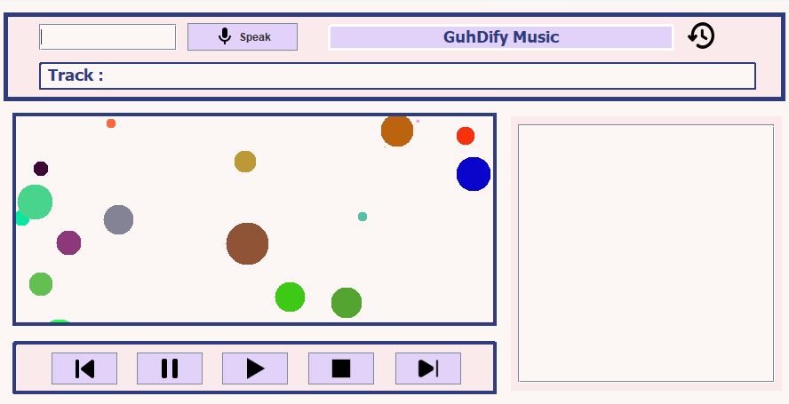

# GuhDify Music Player



GuhDify Music Player is a vibrant and aesthetically pleasing music player, developed using Java Swing. This project utilizes the Google Speech to Text API and the Spotify API to provide a wide range of functionality.

With GuhDify, you can search for your favorite songs,control the music player with voice commands and of course, play your favourite songs!

## Table of Contents

- [API](#api)
- [Installation](#installation)
- [Usage](#usage)

## API

* **Google Speech to Text API** - Navigate and control the music player with your voice.
* **Spotify API Integration** - Listen to millions of songs from Spotify's extensive library.

## Installation

**Pre-requisites**

- [Java Development Kit (JDK)](https://www.oracle.com/java/technologies/javase-jdk11-downloads.html)
- [Git](https://git-scm.com/downloads)

Follow these steps to get GuhDify running on your machine:

1. **Clone the repository:**

   Open a Terminal or a Command Prompt and enter the following command:

    ```
    $ git clone https://github.com/GuhD01/GuhDify
    ```

2. **Navigate to the cloned directory:**

    ```
    $ cd GuhDify
    ```

3. **Compile the code:**

   Assuming you have the JDK installed, you should be able to compile the code using the `javac` command.

    ```
    $ javac Main.java
    ```

4. **Run the application:**

   Now, you can start the application using the `java` command.

    ```
    $ java Main
    ```

## Usage

* To play music, use the search bar to find your favorite songs or browse through the available playlists.
* To choose music you can also click on the microphone button.
* GuhDify can handle commands such as 'play', 'pause', 'next', 'stop' and 'prev'.
* Check music logs by pressing the history button on the top left

<h2 style="color:orange;">Feel The Music</h2>


